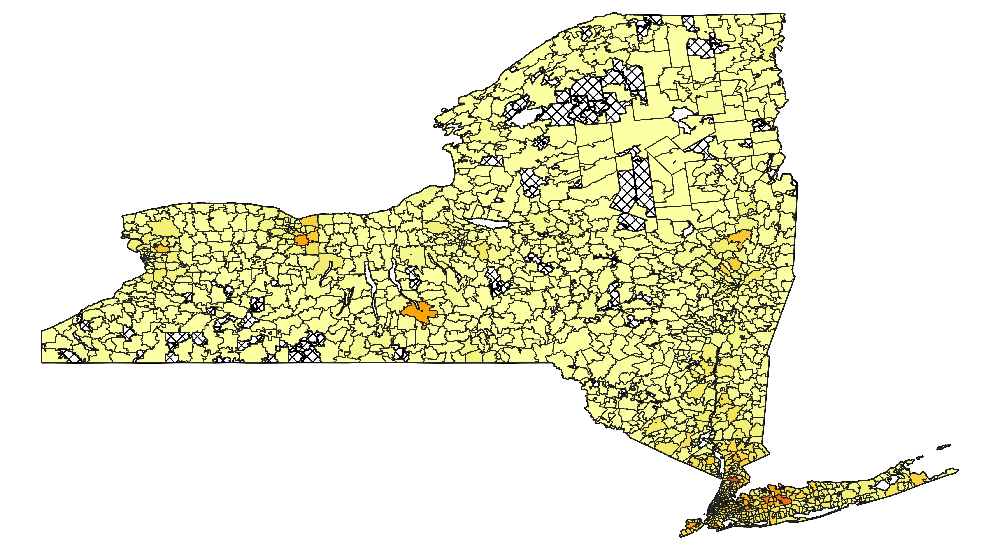
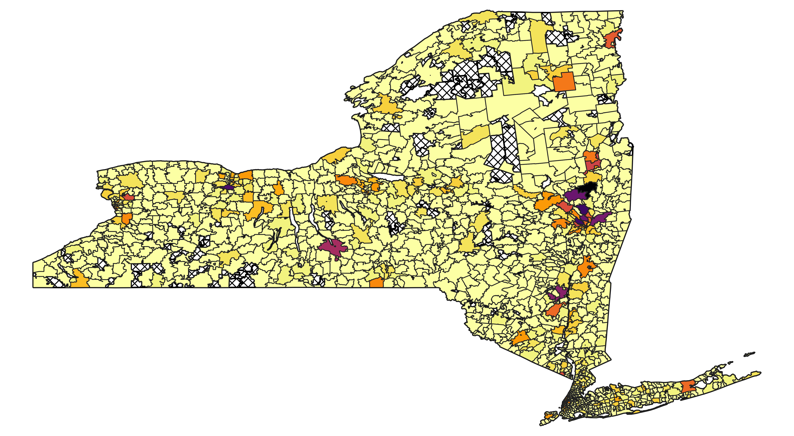
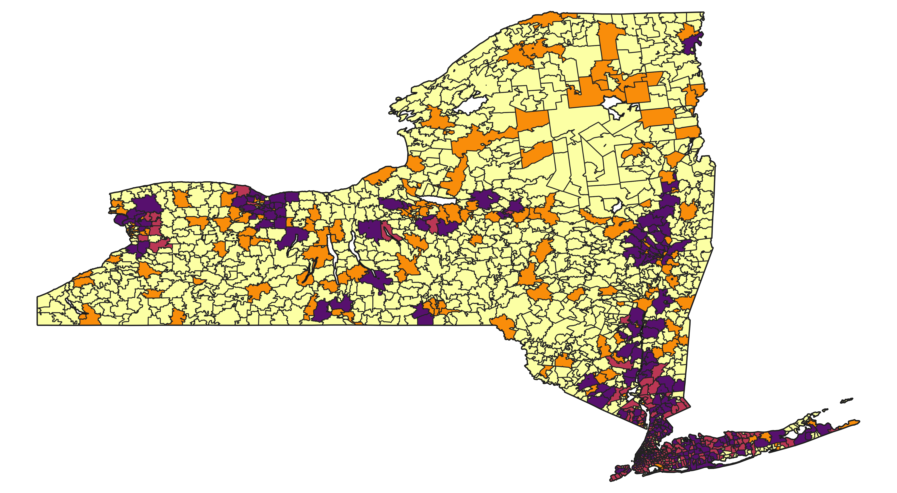
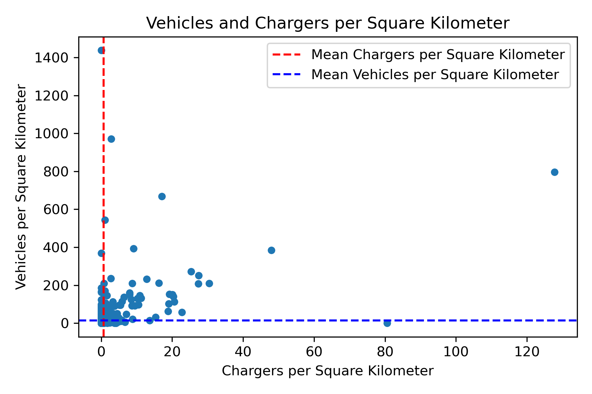

# Electric Vehicles and Chargers by Zip Code

## Purpose:
With the growing affordability and demand for electric vehicles, there is a need to understand the strengths of the current infrastructure in place to determine both inefficiencies as well as any inequities. As more people rely on these stations to charge their vehicles, they may be required to travel to areas far from where they live and work or are inconvenient for them to reach. While charging from home is an option, the reliance of residents on these stations should not be discounted, and understanding the inefficiencies with the current system of stations is important for determining what policies to pursue in the future. Knowing where these potential inefficiencies lie and finding a way to address them is an important aspect when looking towards the development of future charging stations. Locations of charging stations can also result in not just inefficiencies but also inequities, preventing people from having easy access to these stations and inhibiting their ability to use their electric vehicles. As more people advocate for the use of electric vehicles, ensuring easy access to charging stations is an important step that will need to be taken, and discovering where the inequities lie now is important for policymakers. To summarize, analyzing the current network in New York State is the purpose of this repository; serving as a way to highlight potential issues now while also being able to serve as a firm foundation for future analysis going forward. 

## Script Descriptions:

1. **ev_chargers.py:** The purpose of this script is to retrieve data from the National Renewable Energy Laboratory regarding locations for charging stations. By using a key value for the API, the data for New York is retrieved and a CSV file is created titled "EV_Chargers.csv" that contains all the necessary information regarding the locations of charging stations. 
2. **vehicles.py:** Opposed to the "ev_chargers.py" script, this script simply reads a CSV file titled "Vehicle, Snowmobile, and Boat Registrations" obtained from Data.NY.Gov which contains all vehicle registrations in New York State. This script also pulls out information from the file and creates a new CSV file titled "Electric_Vehicles_NY_2024.csv" that contains information on every electric vehicle in the state.  
3. **vehicles_and_chargers.py:** This script merges the two CSV files that were created in the previous two scripts into a new DataFrame titled "ny_data." Zip codes not belonging to New York State are also categorized as non-NY in this script; this ensures that the data remains unchanged while also giving an indicator of what in this DataFrame is not from New York State. A new DataFrame is created to handle these zip codes from out of state, that DataFrame is titled "non_ny_zip" and is used to sum up the number of vehicles as well as chargers not from New York provided by the original data sources. With everything categorized, the "ny_data" DataFrame is converted to a pickle file for conversion to a GeoPackage and further analysis.
4. **geo_and_scatter.py:** With "ny_data" now a pickle file, this script merges it with a new DataFrame called "nyszips" which was created from two zip files called "cb_2020_us_state_500k.zip" and "cb_2020_us_zcta520_500k.zip" both of which were downloaded from the census bureau. "nyszips" isolates the zip codes of New York along with the state boundaries so they can be used to generate a map of the state with all the zip codes shown. With these DataFrames merged, new columns can be created for "ny_data" calculating the average number of vehicles and chargers as well as columns used to categorize these zip codes based on their position in comparison to the averages. After categorizing the individual zip codes, "ny_data" is converted into a GeoPackage so the information within the DataFrame can be used to create heatmaps. In addition to the creation of the GeoPackage, the number of vehicles and chargers per square kilometer for every zip code is calculated and displayed in a scatter plot to show where many zip codes fall when it comes to the number of vehicles and the number of chargers. While the other scripts primarily served to filter data and create DataFrames, this script serves primarily as a way to prepare the data to be displayed for policy analysis purposes. 

## Maps and Scatter Plot: 
**Number of Vehicles in New York State**

The heatmap above shows where electric vehicles are concentrated in New York with a large number being located closer to New York City and Long Island. However, there are other areas of the state with considerable numbers of electric vehicles, primarily the Rochester and Ithaca areas. Areas without any color were not included in the "ny_data" DataFrame as they had no values associated with them or, in other words, there were no electric vehicles registered in that zip  

**Number of Chargers in New York State**

The heatmap above shows where electric vehicle chargers are located in New York, and like the number of vehicles, there is a considerable number of chargers located close to New York City and Long Island. In contrast to the number of vehicles, there are many other areas with a high concentration of chargers: areas such as Albany, Syracuse, and Plattsburgh. These areas may not have had a large number of electric vehicles registered in those areas, however, they have a greater share of chargers when compared with the rest of the state. Similarly, areas without color were not included in the "ny_data" DataFrame and had no chargers in those zip codes. 

**Zip Codes Categorized by Averages**

The heatmap above shows the zip codes in New York State categorized by their averages. In the script "geo_and_scatter.py", a column is created that creates a numerical variable for the averages of each zip code: 0 = Below Average Chargers and Vehicles, 1 = Above Average Chargers and Below Average Vehicles, #2 = Below Average Chargers and Above Average Vehicles, 3 = Above Average Vehicles and Chargers. This heatmap simply visualizes this information with light yellow representing 0, orange representing 1, red representing 2, and purple representing 3. While the previous two heatmaps demonstrated where the vehicles and chargers were located, this map shows how the areas compare with each other. As can be seen, a lot of the areas previously mentioned have vehicles and chargers above the state average. What is interesting about looking at this map is that there are a surprising number of areas that have few electric vehicles, but the number of chargers is above average. It is also important to note that areas that were previously excluded due to no data being available are shown in light yellow, as they have below-average amounts of electric vehicles and chargers.

**Vehicles and Chargers per Square Kilometer**

The scatter plot shown above displays the number of vehicles and chargers per square kilometer for every individual zip code. What the lines show are the averages of vehicles and chargers per square kilometer, breaking the plot into quadrants where it can be seen where these points fall in comparison with each other. Most points are huddled together toward the averages, however, there are a few outliers that have significantly more chargers or vehicles than the average. It is also worth noting that the range of vehicles grouped around the average for the chargers is fairly wide, stretching from 0 to 200 and showing that roughly the same number of chargers services either 0 or 200 vehicles in its zip code. 